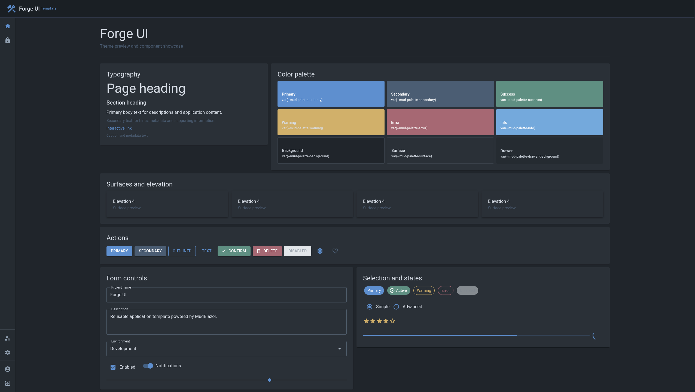
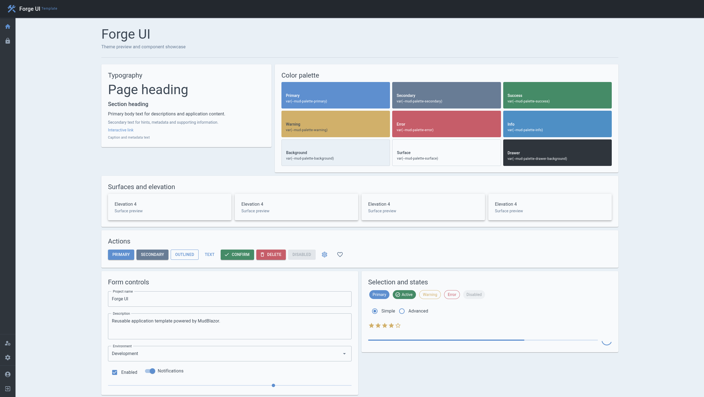
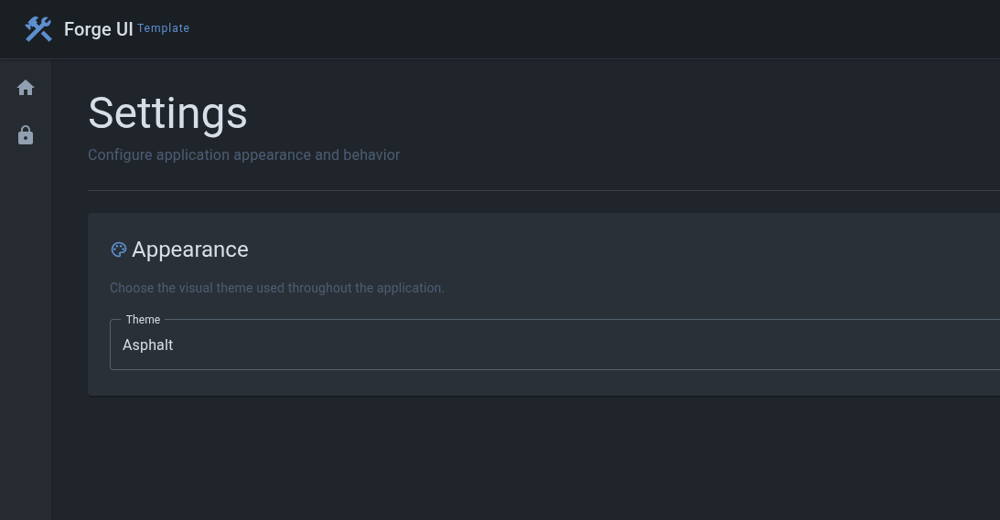
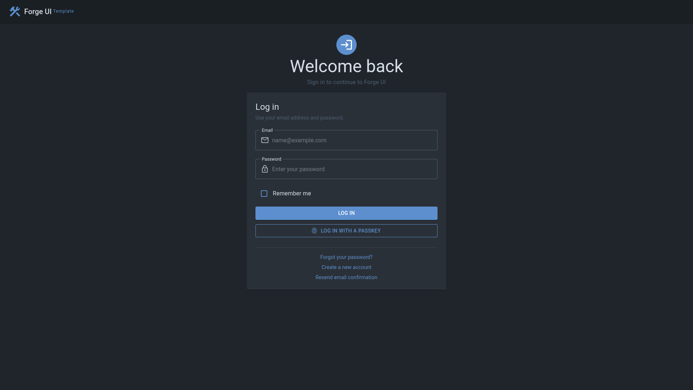

# 🛠️ Forge UI


---

A modern ASP.NET Core application template built with Blazor and MudBlazor.

> [!IMPORTANT]
> Forge UI is currently under active development as a reusable application template.
>
> Some features may be incomplete or subject to change.

<p align="center">
  <a href="docs/images/forge-ui-dark.png">
    
  </a>

  <a href="docs/images/forge-ui-light.png">
    
  </a>
</p>

---

## Settings

Forge UI includes built-in management of global application settings and is being extended with support for user-specific settings.

<p align="center">
  <a href="docs/images/application-settings.png">
    
  </a>
</p>

User settings storage is currently under development.

---

## Authentication

The template includes ASP.NET Core Identity with styled authentication and account management pages.

<p align="center">
  <a href="docs/images/forge-ui-login.png">
    
  </a>

  <a href="docs/images/forge-ui-account.png">
    
  </a>
</p>

---

## Technology stack

- .NET
- ASP.NET Core
- Blazor
- MudBlazor
- ASP.NET Core Identity
- Entity Framework Core
- SQLite

---

## Getting started

Create a new repository from Forge UI using the **Use this template** button.

Alternatively, clone Forge UI directly:

```bash
git clone https://github.com/zmaxb/forge-ui.git
cd forge-ui
```

Restore dependencies:

```bash
dotnet restore
```

Apply database migrations:

```bash
dotnet ef database update
```

Run the application:

```bash
dotnet run
```

Open the application in your browser and select **Create a new account**.