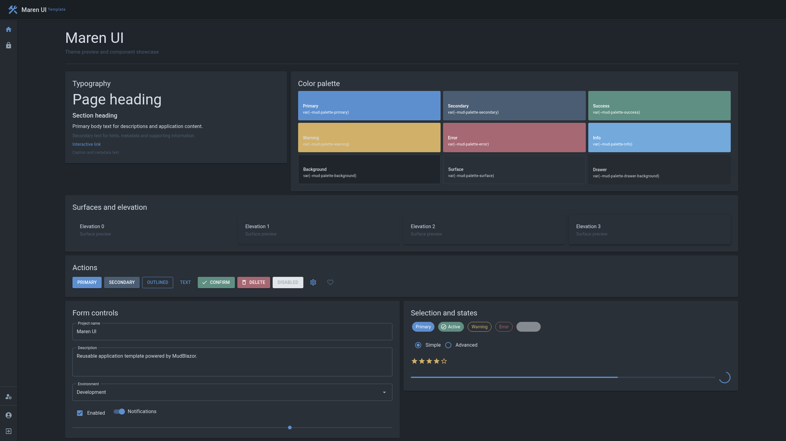
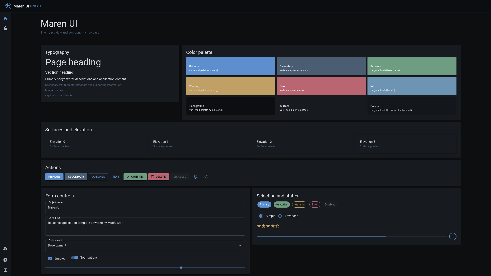
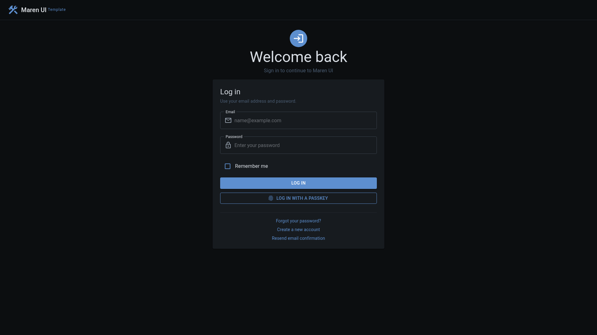
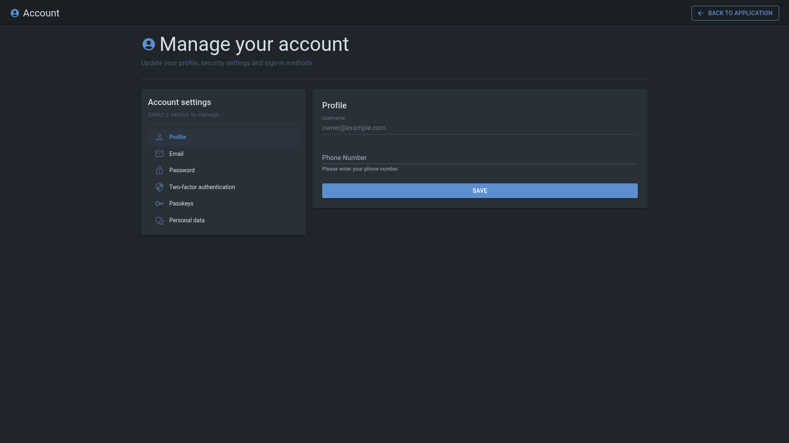

# 🛠️ Maren UI

<table>
  <tbody>
    <tr>
      <td>
        
      </td>
      <td>
        
      </td>
      <td>
        
      </td>
    </tr>
  </tbody>
</table>

A modern ASP.NET Core application template built with Blazor and MudBlazor.

> [!IMPORTANT]
> Maren UI is currently under active development as a reusable application template.
>
> Some features may be incomplete or subject to change.

<table>
  <thead>
    <tr>
      <th width="50%">Carbon</th>
      <th width="50%">Slate</th>
    </tr>
  </thead>
  <tbody>
    <tr>
      <td>
        <a href="docs/images/maren-ui-carbon.png">
          
        </a>
      </td>
      <td>
        <a href="docs/images/maren-ui-slate.png">
          
        </a>
      </td>
    </tr>
  </tbody>
</table>

---

## Settings

Maren UI includes built-in management of global application settings and
user-specific settings. Users can override selected global preferences for
their account.

<p align="center">
  <a href="docs/images/application-settings.png">
    
  </a>
</p>

---

## Authentication

The template includes ASP.NET Core Identity with styled authentication and account management pages.

<table>
  <tbody>
    <tr>
      <td width="50%">
        <a href="docs/images/maren-ui-login.png">
          
        </a>
      </td>
      <td width="50%">
        <a href="docs/images/maren-ui-account.png">
          
        </a>
      </td>
    </tr>
  </tbody>
</table>

---

## Technology stack

- .NET
- ASP.NET Core
- Blazor
- MudBlazor
- ASP.NET Core Identity
- Entity Framework Core
- SQLite

---

## Getting started

Create a new repository from Maren UI using the **Use this template** button.

Alternatively, clone Maren UI directly:

```bash
git clone https://github.com/zmaxb/maren-ui.git
cd maren-ui
```

Restore dependencies:

```bash
dotnet restore
```

Apply database migrations:

```bash
dotnet ef database update --project src/MarenUI.Web
```

Run the application:

```bash
dotnet run --project src/MarenUI.Web
```

Open the application in your browser and select **Create a new account**.

To bootstrap the first administrator, set the email of an existing account
and restart the application:

```bash
dotnet user-secrets set \
  "Authorization:BootstrapAdminEmail" \
  "admin@example.com" \
  --project src/MarenUI.Web
```

After the first administrator is assigned, administrator access can be managed
on the global settings page. The bootstrap setting is ignored while at least
one administrator exists.
